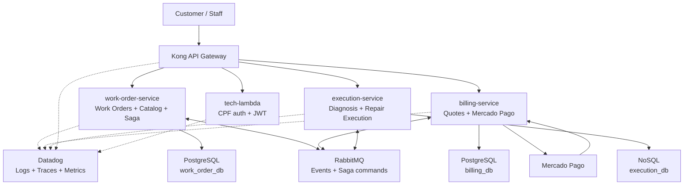
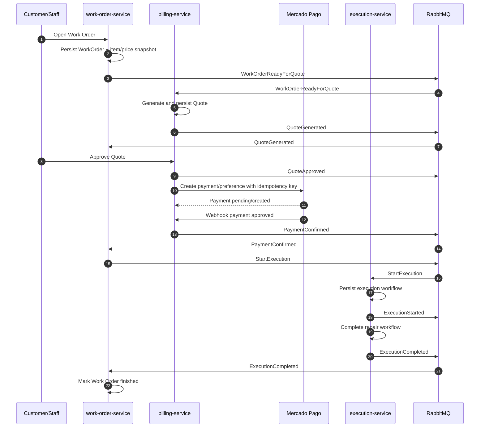
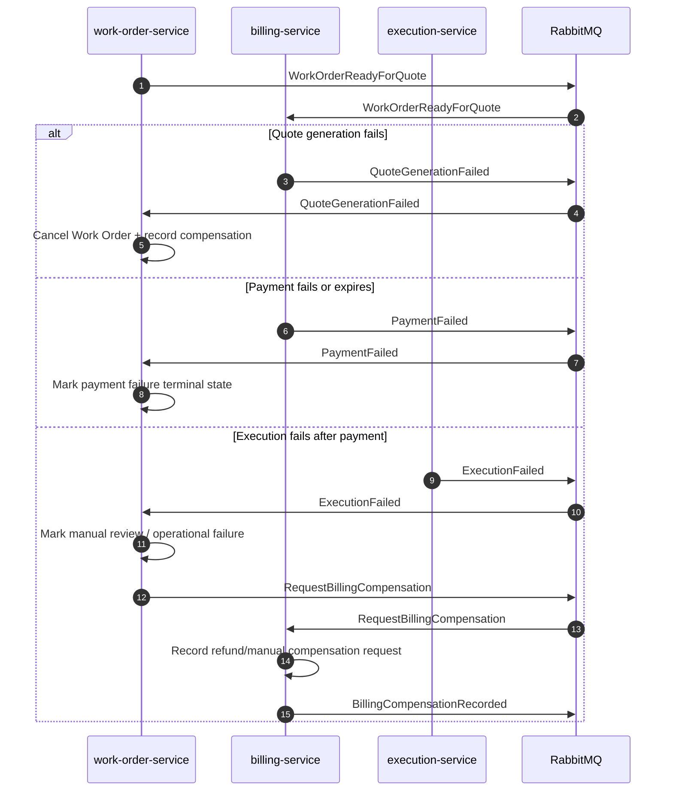

# Microservices Architecture

Phase 4 evolves the previous modular monolith into three independent
microservices while reusing the Phase 3 platform assets: Kong, CPF
authentication Lambda, Kubernetes, CI/CD, Datadog, Docker, and database
infrastructure patterns.

## Service Ownership

| Service | Owns | Does not own |
| --- | --- | --- |
| `work-order-service` | Customers and vehicles needed for Work Orders, repair service catalog, Work Order lifecycle, item/price snapshots, status history, Saga orchestration. | Quote lifecycle, payment provider state, execution workflow internals. |
| `billing-service` | Quote generation from snapshots, quote approval/refusal, Mercado Pago payment creation, payment webhooks, payment status. | Work Order database, catalog database, execution workflow. |
| `execution-service` | Diagnosis workflow, repair execution queue, progress, completion and failure outcomes. | Work Order database, quote/payment database. |

No service may access another service's database. Integration happens through
RabbitMQ events/commands and controlled REST APIs when strictly needed.

## Runtime Architecture

## Saga Strategy

The Saga is orchestrated by `work-order-service`.

Reasoning:

- The Work Order is the central business lifecycle.
- The orchestrator can keep one readable Saga state for evaluation and support.
- Billing and Execution keep local autonomy: they own their transactions and
  publish outcomes, but do not coordinate the whole process.
- Compensation steps are explicit messages, which makes failure handling easier
  to demonstrate in the final video.

## Happy Path

## Compensation Paths

## Data Ownership

| Data | Owner | Notes |
| --- | --- | --- |
| Customer data needed for Work Orders | `work-order-service` | Stored locally for intake and customer status queries. |
| Vehicle data | `work-order-service` | Linked to customer and Work Order. |
| Repair service catalog | `work-order-service` | Source of pricing snapshot at Work Order opening. |
| Quote | `billing-service` | Generated automatically from `WorkOrderReadyForQuote`. |
| Payment | `billing-service` | Stores Mercado Pago IDs, local external reference, idempotency key, and status. |
| Execution workflow | `execution-service` | Stored in the selected NoSQL database. |
| Saga state | `work-order-service` | Tracks orchestration step, outcomes, and compensation status. |

## Observability

All services must log and propagate:

- `correlationId`
- `messageId`
- `workOrderId` when available
- service name, environment, and version

Kubernetes manifests must keep Datadog service labels so logs, metrics, and
traces can be filtered per service during the final demonstration.
